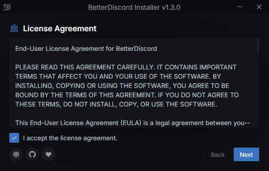
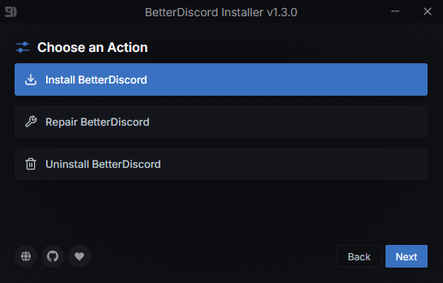
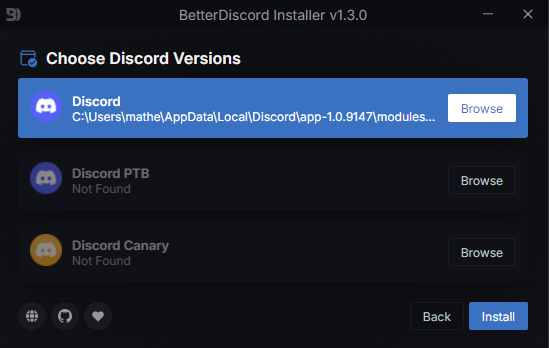
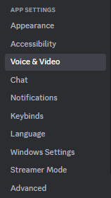
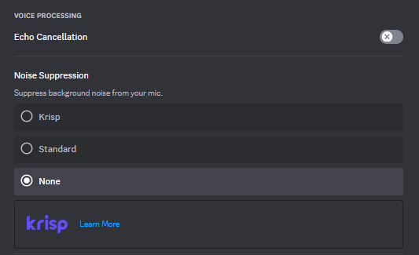
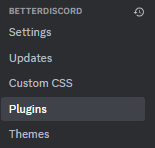
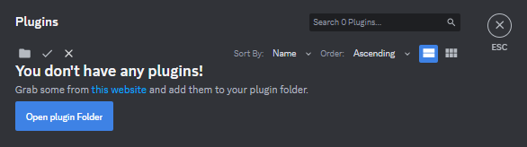
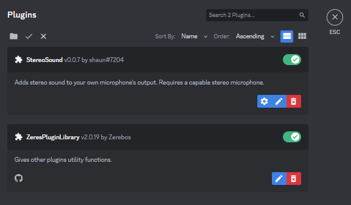

# Configurando **Áudio Estéreo** no **Discord**

O **áudio estéreo** no **Discord** permite que você ouça o som de outras pessoas com mais clareza e realismo, proporcionando uma experiência de voz mais imersiva. Em vez de um único canal de áudio mono, o som é dividido em dois canais separados, cada um representando um lado do seu fone de ouvido.

No entanto, o **áudio estéreo** não está disponível nativamente no Discord. Para habilitá-lo, você precisa usar um plugin de terceiros, como o **StereoSound.plugin.js** e o **0PluginLibrary.plugin.js** em conjunto com o **BetterDiscord**.

Também será necessário ter um aplicativo que gerencie as faixas de áudio, para isso séra usado o **Voicemeeter Banana**, o tutorial de instalação e configuração deste aplicativo está neste repositório: [voicemeeter_banana](https://github.com/matheusaudibert/voicemeeter_banana)

## Índice

1. [Instalação do BetterDiscord](#instalação-do-betterdiscord)

2. [Configuração do Discord](#configuração-do-discord)

3. [Instalação dos Plugins](#instalação-dos-plugins)

4. [Ativação dos Plugins](#ativação-dos-plugins)

5. [Referências](#referências)

## Instalação do BetterDiscord

O **BetterDiscord** é um aplicativo de terceiros que permite aos usuários do Discord personalizarem a experiência do aplicativo de diversas maneiras. Ele funciona como uma extensão que adiciona recursos e funcionalidades extras ao Discord, não disponíveis na versão nativa.

Faça o download do **BetterDicord** [aqui](https://github.com/matheusaudibert/Discord_StereoSound/blob/main/betterdiscord/BetterDiscord-Windows.exe) ou baixe no site oficial: https://betterdiscord.app

Ao executar o programa, siga os seguintes passos:

- Aceite os **termos e condições** e prossiga.

- Selecione a Opção **Install BetterDicord**.

- Selecione a sua versão do **Discord**.

## Configuração do Dicord

Com o BetterDiscord instalado, abra o Discord.

- Localize a configuração **Voz e vídeo**.

- Desative o **Cancelamento de eco** e selecione o opção **nenhum** em **Supressão de ruído**.

## Instalação dos Plugins

Instale os Plugins. Os arquivos estão [aqui](https://github.com/matheusaudibert/Discord_StereoSound/tree/main/plugins).

Crie uma pasta chamada **Arquivos_Plugins** e mova os arquivos para a pasta.

## Ativação dos Plugins

Para ativar os Plugins, abra o Discord, com o BetterDiscord já instalado, e vá até **configurações**.

- Localize a configuração **Plugins**.

- Abra a pasta de **Plugins** do Discord.

- Mova os **plugins** da pasta **Arquivos_Plugins**, para a pasta **Plugins do Discord**.

- Habilite os **plugins**.

Após isso, os plugins ja estarão ativos e funcionando, e seu áudio estará estéreo. Lembrando que é necessário ter um gerenciador de áudio.

Guia de instalação do [Voicemeeter_Banana](https://github.com/matheusaudibert/voicemeeter_banana).

## Referências

Para a construção deste repositório foram usadas as seguintes referências.

Voicemeeter Banana - https://github.com/matheusaudibert/voicemeeter_banana

ZeresPluginLibrary - https://betterdiscord.app/plugin/ZeresPluginLibrary

Stereo - https://github.com/sh6un/Stereo
